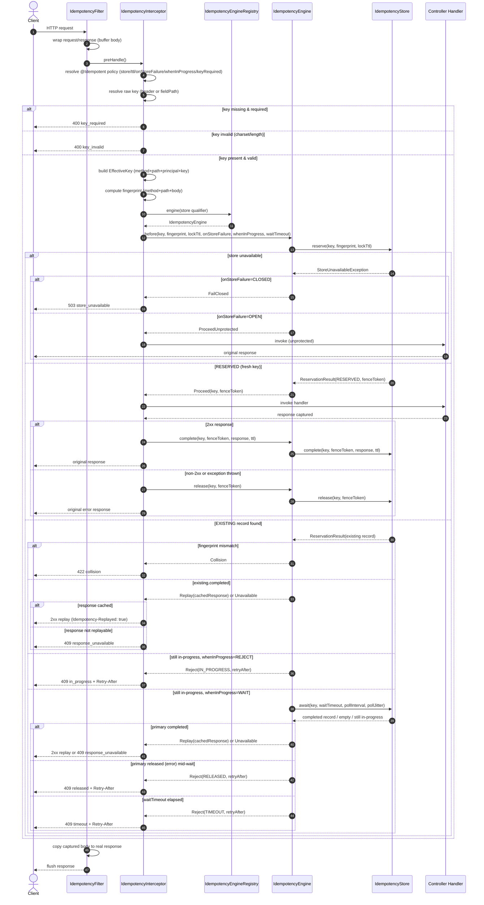

# Idempotency for Spring Boot

A drop-in, per-endpoint idempotency mechanism for Spring Boot REST services. Mark a
handler `@Idempotent`, pick where the key comes from and which store backs it, and
the library takes care of the rest: caching the first response, rejecting or
waiting on concurrent duplicates, detecting a key reused for a different payload,
and degrading sanely if the store goes down.

## Why use this

Retries, double-clicks, and at-least-once message redelivery all cause the same
class of bug: an operation runs more than once (a payment charged twice, an order
created twice). Teams usually reinvent this with an ad-hoc unique constraint or a
"check before insert," and rarely handle the hard parts — concurrent duplicates in
flight, replaying the *original* response, telling a genuine retry apart from a key
reused for a different request, and behaving well when the store is unavailable.

This library gives you that as a single annotation:

```java
@PostMapping("/orders")
@Idempotent(header = Idempotent.IDEMPOTENCY_KEY_HEADER)
public ResponseEntity<Order> createOrder(@RequestBody OrderRequest request) { ... }
```

A repeat request with the same effective key returns the original response
(status, headers, body) instead of re-executing the handler, flagged with
`Idempotency-Replayed: true`.

**Use it when:**
- Clients may retry the same request (network timeouts, double-clicks, message redelivery).
- The operation has a side effect that must not run twice (charge, create, decrement stock).

**Skip it when:** the operation is naturally idempotent already (e.g. a `PUT` that
just overwrites state), or is a pure read.

## How it works

- **Effective key** — one key per request, resolved by a strategy you choose per
  endpoint:
  - `header` — the key comes from a client-supplied header (e.g. `X-Idempotency-Key`). Covers retries/double-clicks from a client that reuses the same key.
  - `fieldPath` — a JSONPath into the request body (e.g. `$.order.id`). Covers clients you don't control, deduplicated by business identity.

  Exactly one of the two is required — validated at application startup.
- **Scope** — endpoint + authenticated principal + key value. The same key value
  on two different routes, or from two different users, never collides.
- **Collision** — same key, different body (by a method+path+body fingerprint) →
  `422`.
- **Concurrency** — a second request finding the key in-progress either gets an
  immediate `409` (`whenInProgress = REJECT`, the default) or blocks for the
  primary's result (`WAIT`).
- **Caching** — only `2xx` responses are cached. Any error response, or the
  handler throwing, releases the key so a genuine retry can proceed.
- **Expiration** — a default 24h TTL (configurable). An expired key behaves as a
  brand-new one.
- **Store failure** — fail-open by default (request goes through unprotected);
  fail-closed (`503`) is opt-in per endpoint.

See `CONTEXT.md` for the full glossary and `docs/adr/` for the design rationale.

### Request flow



## Install

Group id `io.adzubla.blocks`, artifacts `blocks-idempotency-core`,
`blocks-idempotency-store-redis`, `blocks-idempotency-store-postgres`. Add `core`
plus whichever store module(s) your endpoints use — each store is an optional
module so you don't pull in Redis or JDBC you don't need.

```xml
<dependency>
    <groupId>io.adzubla.blocks</groupId>
    <artifactId>blocks-idempotency-core</artifactId>
    <version>0.1.0-SNAPSHOT</version>
</dependency>
<dependency>
    <groupId>io.adzubla.blocks</groupId>
    <artifactId>blocks-idempotency-store-redis</artifactId>
    <version>0.1.0-SNAPSHOT</version>
</dependency>
```

Each store module auto-configures its `IdempotencyStore` bean under a qualifier
(`"redis"` / `"postgres"`) as soon as its Spring Boot starter (`spring-boot-starter-data-redis`
/ `spring-boot-starter-jdbc` + a `DataSource`) is on the classpath and configured.
`core` never provides a default store — you need at least one store module. Both
modules can be on the classpath at once: each `@Idempotent(store = ...)` routes
independently to the store it names, so one application can back some endpoints
with Redis and others with Postgres.

## `@Idempotent` reference

```java
@Idempotent(
    header = Idempotent.IDEMPOTENCY_KEY_HEADER,  // "X-Idempotency-Key"; xor fieldPath = "$.order.id"
    store = RedisIdempotencyStore.QUALIFIER,     // "" inherits idempotency.default-store
    ttl = "PT1H",                                // "" inherits idempotency.default-ttl
    keyRequired = true,                          // fixed default, does not inherit
    onStoreFailure = OnStoreFailure.CLOSED,      // DEFAULT inherits the global posture
    whenInProgress = WhenInProgress.WAIT         // DEFAULT inherits the global posture
)
```

Global defaults live under `idempotency.*` in `application.properties`:

```properties
# store qualifier used when @Idempotent leaves store=""; no default - required
# unless every @Idempotent sets store= explicitly
idempotency.default-store=redis
# response TTL used when @Idempotent leaves ttl=""
idempotency.default-ttl=24h
# posture when the store is unavailable: OPEN lets the request through, CLOSED returns 503
idempotency.default-on-store-failure=OPEN
# behavior for a concurrent in-progress key: REJECT returns 409, WAIT blocks for the primary's result
idempotency.default-when-in-progress=REJECT
# how long a reservation is held before an abandoned one is treated as gone (anti-poisoning)
idempotency.lock-ttl=30s
# how long a WAIT caller blocks for the primary's result before giving up
idempotency.wait-timeout=5s
# base delay between WAIT-mode polls, for stores without a native blocking
# wait (Postgres has one and ignores both of these)
idempotency.poll-interval=100ms
# extra random delay added to each poll, up to this much
idempotency.poll-jitter=50ms
# responses over this size aren't cached; a replay then gets 409 response_unavailable
idempotency.max-body-size=1MB
# max length of the raw key value (header or body-field); longer values are
# rejected with 400, as is any value outside the fixed charset [A-Za-z0-9_.:-]+
idempotency.key.max-length=255
# fold the authenticated principal into the key scope
idempotency.scope.principal-enabled=true
# opaque value passed to the active PrincipalClaimResolver bean; the default
# resolver ignores it and always scopes by Principal#getName() - see "Scoping
# by a custom principal claim" below
idempotency.scope.principal-claim=sub
# header used to flag a replayed response
idempotency.replay.header-name=Idempotency-Replayed
# headers stripped from a replay; Set-Cookie is always stripped regardless of this list
idempotency.replay.header-denylist=Date,Set-Cookie,traceparent,tracestate
# emit counters for replay/collision/concurrency/fail-open outcomes (needs a MeterRegistry)
idempotency.metrics.enabled=true
```

A misconfigured `@Idempotent` (both/neither of `header`/`fieldPath`, an invalid
TTL, or a `store` qualifier with no matching bean) fails application startup, not
the first request.

### Scoping by a custom principal claim

By default the key scope's principal is `Principal#getName()` off
`HttpServletRequest.getUserPrincipal()`. To scope by something else instead
(e.g. a JWT claim, when the request's principal is your auth stack's own JWT
token type), register a `PrincipalClaimResolver` bean — `core` has no
dependency on any particular auth library, so this is left to the application:

```java
@Bean
PrincipalClaimResolver principalClaimResolver() {
    return (principal, claim) -> principal instanceof JwtAuthenticationToken jwt
            ? jwt.getToken().getClaimAsString(claim)
            : null; // null falls back to Principal#getName()
}
```

`claim` is whatever `idempotency.scope.principal-claim` is set to (default
`"sub"`), passed through verbatim — the library never inspects it itself. With
no such bean registered, `DefaultPrincipalClaimResolver` is used, which ignores
`claim` and always returns `Principal#getName()`.

## Stores

|             | Redis                                                                   | Postgres                                                      |
|-------------|-------------------------------------------------------------------------|---------------------------------------------------------------|
| Guarantee   | Best-effort                                                             | Exactly-once, if the effect writes to the same database       |
| Concurrency | Polling (~100ms + jitter)                                               | Native row lock, blocks until the holder commits/rolls back   |
| Good for    | External or non-transactional effects (calls to other services, emails) | Effects that are themselves a write to this Postgres database |

Store choice is per endpoint, not per application: register both modules and set
`store` on each `@Idempotent` to pick Redis for one handler and Postgres for
another in the same service.

### In-memory store

`InMemoryIdempotencyStore` (in `core`) is the reusable test double used by the
library's own test suite. It is **not** auto-configured and not meant for
production — state is a local `ConcurrentHashMap`, lost on restart and not shared
across instances. Register it yourself only for tests or a single-instance
prototype.

### Redis

Qualifier `"redis"`. Best-effort: fast, but a Redis blip or eviction can lose a
reservation. One Redis **Hash** per record, keyed by a SHA-256 of
method/path/principal/key — a single key per record, so it works under Redis
Cluster with no cross-slot operations. Reserve and complete are atomic Lua
scripts. Lifecycle rides Redis's own key TTL: reserve → `lock-ttl` (~30s),
complete → the response TTL, failure → delete.

Requires `spring-boot-starter-data-redis` and a configured `StringRedisTemplate`
(standard `spring.data.redis.*` properties).

```properties
# prefix for the hashed record key; namespace multiple apps sharing one Redis instance
idempotency.redis.key-prefix=idempotency:
```

**Use when** the protected effect is external or non-transactional (a payment
gateway call, sending an email, calling another service) — you get fast
protection without a false promise of atomicity with your own database.

### Postgres

Qualifier `"postgres"`. Exactly-once *for effects that write to the same
database*: `reserve()` opens the transaction the handler's effect runs in (it
joins transparently via ordinary `@Transactional`/plain JDBC on the same
thread); `complete()` commits response + effect together; `release()` rolls back
both. Concurrency is native — a second reservation blocks on the row's
`UNIQUE`/primary-key conflict until the first commits or rolls back, bounded by
`lock_timeout`. `whenInProgress = WAIT` uses this same native block instead of
polling, so `idempotency.poll-interval`/`idempotency.poll-jitter` don't apply
here — a waiter resolves the instant the primary commits or rolls back, not on
the next poll tick.

Requires `spring-boot-starter-jdbc`, a `DataSource`/`PlatformTransactionManager`,
and the `idempotency_record` table. A Flyway migration
(`V1__idempotency_record.sql`) ships with the module (optional dependency) —
either let Flyway auto-run it or apply it with your own migration tool. A
built-in scheduled job sweeps expired rows (Postgres has no native TTL).

```properties
# upper bound a waiter blocks on the reservation row's native lock before giving up
idempotency.postgres.lock-timeout=2s
# disable to sweep expired rows with your own job/cron instead
idempotency.postgres.cleanup.enabled=true
# how often the sweep runs
idempotency.postgres.cleanup.interval=5m
```

**Use when** the protected effect is a write to this same Postgres database (e.g.
creating an order row) — you get a real exactly-once guarantee, not just
best-effort caching. Not currently supported with async handlers
(`Callable`/`DeferredResult`/WebFlux) since those can hop threads mid-request,
which breaks the thread-bound transaction this store relies on.

## Status codes at a glance

Every rejecting outcome is thrown by the interceptor as a typed
`IdempotencyException` rather than written to the response directly, so it
flows through Spring's normal exception-handling machinery just like an
exception thrown from a controller method. A default `@ControllerAdvice`
(`IdempotencyExceptionHandler`, auto-registered by the library) turns each one
into the bare status(+headers)/no-body response below. Every non-2xx response
carries `Idempotency-Reject-Reason` — a single closed vocabulary uniform
across all of them, so a client can always tell the root cause apart from any
other error the application itself might return at that status code,
without parsing a body. Only the in-progress-duplicate case additionally
carries `Retry-After`, since it alone is the "resend with the same key" case.
The only response the library ever writes a body for is a `2xx` replay, which
reproduces the original captured response verbatim.

| Status                | Meaning                                                                           | Exception                                 | `Idempotency-Reject-Reason`      | Other headers                          | Body                   |
|-----------------------|-----------------------------------------------------------------------------------|-------------------------------------------|----------------------------------|----------------------------------------|------------------------|
| `2xx`                 | Fresh execution, or replay of a cached response                                   | —                                         | —                                | `Idempotency-Replayed: true` on replay | Original response body |
| `409` + `Retry-After` | In-progress duplicate (reject/wait-timeout/released) — safe to retry the same key | `IdempotencyConflictException`            | `in_progress\|released\|timeout` | `Retry-After`                          | empty                  |
| `409`                 | Effect completed but the response can't be replayed (terminal — don't retry)      | `IdempotencyResponseUnavailableException` | `response_unavailable`           | none                                   | empty                  |
| `422`                 | Same key, different payload (fingerprint collision)                               | `IdempotencyCollisionException`           | `collision`                      | none                                   | empty                  |
| `400`                 | Key required but missing                                                          | `IdempotencyKeyRequiredException`         | `key_required`                   | none                                   | empty                  |
| `400`                 | Key value too long, or outside the allowed charset                                | `IdempotencyKeyInvalidException`          | `key_invalid`                    | none                                   | empty                  |
| `503`                 | Store unavailable and `onStoreFailure = CLOSED`                                   | `IdempotencyFailClosedException`          | `store_unavailable`              | none                                   | empty                  |

### Overriding error responses

Because these are ordinary exceptions, an application's own
`@ControllerAdvice` can override any single one of them — just declare an
`@ExceptionHandler` for the same exception type (or for the common
`IdempotencyException` supertype). The library's own advice is registered at
`@Order(Ordered.LOWEST_PRECEDENCE)`, so an application handler for the same
type always wins, letting you wrap idempotency errors in your standard error
body instead of the library's default empty one:

```java
@ControllerAdvice
class ApiErrorHandler {

    @ExceptionHandler(IdempotencyCollisionException.class)
    ResponseEntity<ErrorBody> handleCollision(IdempotencyCollisionException ex) {
        return ResponseEntity.status(ex.status())
                .body(new ErrorBody("IDEMPOTENCY_COLLISION", ex.getMessage()));
    }
}
```
