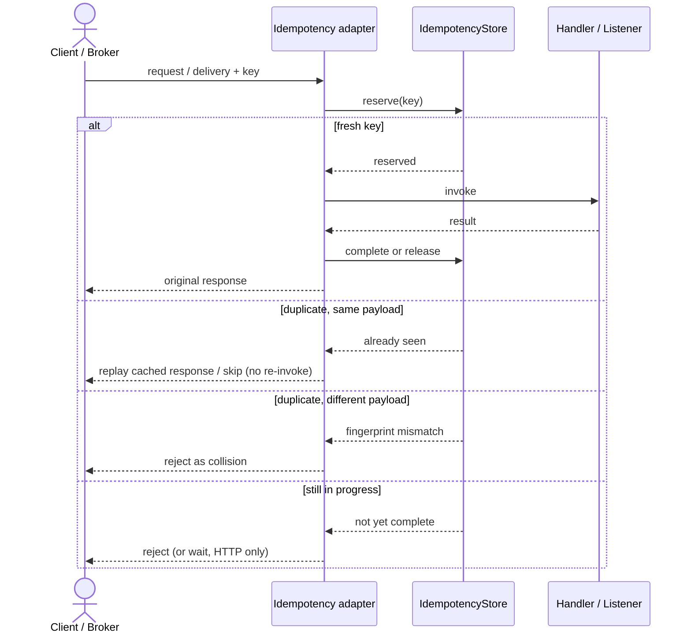

# User Guide — blocks-idempotency

A practical guide to using this library in your own application. For the domain
glossary see `CONTEXT.md`.

## 1. Introduction

`blocks-idempotency` is a drop-in idempotency mechanism for Spring Boot
applications. Mark a REST controller method, or a `@KafkaListener`/
`@RabbitListener`/`@JmsListener` method, with a single `@Idempotent` annotation,
choose where the idempotency key comes from and which store backs it, and the
library takes care of the rest: caching the first response (HTTP) or deduping
the delivery (messaging), rejecting or waiting on concurrent duplicates,
detecting a key that gets reused for a different payload, and degrading sanely
if the store goes down.

It works the same way across four entry-point types — plain HTTP endpoints,
and Kafka, RabbitMQ, and JMS listeners — backed by a choice of storage engines
(in-memory, Redis, Postgres).

## 2. Why use this

Retries, double-clicks, and at-least-once message redelivery all cause the
same class of bug: an operation runs more than once — a payment charged
twice, an order created twice. Teams usually reinvent a fix for this with an
ad-hoc unique constraint or a "check before insert," and rarely handle the
hard parts:

- **Concurrent duplicates in flight** — two copies of the same request
  arriving before the first has finished need a decision (reject? wait?) that a
  naive uniqueness check doesn't make.
- **Replaying the *original* response** — a client that retries a successful
  request expects the same response back, not a fresh error from a broken
  unique-constraint violation.
- **Telling a genuine retry apart from an accidental key reuse** — the same
  key showing up with a *different* payload is a bug in the caller, not a
  retry, and should be rejected loudly rather than silently accepted or
  silently overwritten.
- **Behaving well when the backing store is unavailable** — an ad-hoc
  solution rarely has a considered answer for "what happens if the database
  is down right now," and defaults to either blocking everything or silently
  losing protection.

Centralizing this logic means one audited implementation, consistent
behavior across every endpoint and listener in the codebase, and storage that
can be swapped (or mixed) per handler without touching business logic.

**Use it when:**
- Clients may retry the same request (network timeouts, double-clicks) or a
  broker may redeliver the same message (consumer restart, missed ack,
  redelivery policy).
- The operation has a side effect that must not run twice — a charge, a
  resource creation, a stock decrement.

**Skip it when:**
- The operation is naturally idempotent already — e.g. a `PUT` that just
  overwrites state with the same values every time.
- It's a pure read with no side effect.
- A duplicate is genuinely harmless (a fire-and-forget notification where
  sending it twice costs nothing) and the extra storage round-trip isn't
  worth paying for.

## 3. Getting started

### 3.1. Modules

Group id `io.adzubla.blocks`. Add `core`, plus whichever transport module(s)
your application uses, plus at least one store module — each is optional, so
you don't pull in Kafka, RabbitMQ, JMS, Redis, or JDBC dependencies you don't
need. A single application can mix transports (HTTP endpoints and message
listeners side by side) and stores.

| Artifact                                | Purpose                                                                         |
|-----------------------------------------|---------------------------------------------------------------------------------|
| `blocks-idempotency-core`               | Required. `@Idempotent`, the policy engine, the `IdempotencyStore` abstraction. |
| `blocks-idempotency-web`                | Add for Spring MVC/Servlet REST endpoints.                                      |
| `blocks-idempotency-messaging-kafka`    | Add for `@KafkaListener` methods.                                               |
| `blocks-idempotency-messaging-rabbitmq` | Add for `@RabbitListener` methods.                                              |
| `blocks-idempotency-messaging-jms`      | Add for `@JmsListener` methods.                                                 |
| `blocks-idempotency-store-redis`        | Add for a Redis-backed store.                                                   |
| `blocks-idempotency-store-postgres`     | Add for a Postgres-backed store.                                                |

```xml
<dependency>
    <groupId>io.adzubla.blocks</groupId>
    <artifactId>blocks-idempotency-core</artifactId>
    <version>0.1.0-SNAPSHOT</version>
</dependency>
<dependency>
    <groupId>io.adzubla.blocks</groupId>
    <artifactId>blocks-idempotency-web</artifactId>
    <version>0.1.0-SNAPSHOT</version>
</dependency>
<dependency>
    <groupId>io.adzubla.blocks</groupId>
    <artifactId>blocks-idempotency-store-redis</artifactId>
    <version>0.1.0-SNAPSHOT</version>
</dependency>
```

Each store module auto-configures its `IdempotencyStore` bean as soon as its
Spring Boot starter is on the classpath and configured (`spring-boot-starter-data-redis`
for Redis, `spring-boot-starter-jdbc` + a `DataSource` for Postgres). `core`
never provides a default store on its own — you need at least one store
module. Each messaging module likewise auto-configures its advice as soon as
its listener annotation is on the classpath alongside `core` and a store
module.

### 3.2. Global configuration

Every attribute on `@Idempotent` has a global default you set once under
`idempotency.*` and override per endpoint/listener only where needed:

```properties
# store qualifier used when @Idempotent leaves store=""; no default — required
# unless every @Idempotent sets store= explicitly
idempotency.default-store=redis
# response TTL used when @Idempotent leaves ttl=""
idempotency.default-ttl=24h
# posture when the store is unavailable: OPEN lets the request through, CLOSED returns 503
idempotency.default-on-store-failure=OPEN
# behavior for a concurrent in-progress key: REJECT returns 409, WAIT blocks for the primary's result
idempotency.default-when-in-progress=REJECT
# how long a reservation is held before an abandoned one is treated as gone
idempotency.lock-ttl=30s
# how long a WAIT caller blocks for the primary's result before giving up
idempotency.wait-timeout=5s
# base delay between WAIT-mode polls, for stores without a native blocking wait
idempotency.poll-interval=100ms
# extra random delay added to each poll, up to this much
idempotency.poll-jitter=50ms
# responses over this size aren't cached; a replay then gets 409 response_unavailable
idempotency.max-body-size=1MB
# max length of the raw key value; longer values, or values outside the fixed
# charset [A-Za-z0-9_.:-]+, are rejected with 400
idempotency.key.max-length=255
# fold the authenticated principal into the key scope (HTTP only)
idempotency.scope.principal-enabled=true
# opaque value passed to the active PrincipalClaimResolver bean
idempotency.scope.principal-claim=sub
# header used to flag a replayed HTTP response
idempotency.replay.header-name=Idempotency-Replayed
# headers stripped from a replay; Set-Cookie is always stripped regardless of this list
idempotency.replay.header-denylist=Date,Set-Cookie,traceparent,tracestate
# emit counters for replay/collision/concurrency/fail-open/fail-closed/response-unavailable outcomes (needs a MeterRegistry)
idempotency.metrics.enabled=true
```

A misconfigured `@Idempotent` — both or neither of `header`/`fieldPath` set,
an invalid `ttl`, or a `store` qualifier with no matching bean — fails
**application startup**, not the first request.

## 4. How it works

`@Idempotent` is the single declarative entry point, usable on an HTTP
controller method or a message listener method. Whichever transport it's
applied to, the same sequence happens underneath:

1. **Resolve the raw key** for this request/delivery, using whichever
   strategy the annotation specifies (a header, or a field in the body).
2. **Build an Effective Key** that scopes that raw key to this specific
   endpoint/listener (and, for HTTP, the calling principal) — see
   [Idempotency Key vs Effective Key](#41-idempotency-key-vs-effective-key).
3. **Reserve** the effective key in the configured store. A fresh key
   proceeds; a key already seen goes through the duplicate/collision/
   in-progress handling described in each transport section below.
4. **Invoke the handler/listener method** exactly once for a fresh key.
5. **Complete or release** the reservation depending on the outcome — success
   caches the result (HTTP) or simply marks the delivery done (messaging);
   failure releases the key so a genuine retry can proceed.

This flow lives in one transport-neutral core module; each transport (HTTP,
Kafka, RabbitMQ, JMS) has a thin adapter that plugs its own request/delivery
shape into the same underlying engine and store. That's why the behavior,
configuration shape, and terminology are consistent everywhere you use
`@Idempotent` — differences between transports are called out explicitly in
each transport's own section further down, rather than being separate
mechanisms.

### 4.1. Idempotency Key vs Effective Key

**Idempotency Key** — a value that identifies *one intent to perform an
operation*. It's whatever the caller (client or upstream service) supplies to
say "this is the same logical operation as last time." Two requests carrying
the same key mean the same intent; a retry after a timeout should resend the
identical key, not a new one.

You choose, per endpoint/listener, where this raw key comes from:

- **Header strategy** (`header = ...`) — the key comes from a client-supplied
  HTTP header (e.g. `X-Idempotency-Key`) or a broker message header/property.
  This represents the *caller's* intent, and covers network retries or
  double-clicks from a caller that deliberately reuses the same key, or a
  broker redelivering the same message.
- **Body-field strategy** (`fieldPath = ...`) — the key is extracted from a
  field in the request/message body via a JSONPath, e.g.
  `fieldPath = "$.order.id"`. This represents *business identity* and covers
  callers you don't control or coordinate a header with, deduplicated by
  which entity the request refers to.

Exactly one of the two must be set on `@Idempotent` — this is validated at
application startup, not at request time.

By default a missing key fails the request/delivery (`400 key_required` for
HTTP, dead-lettered for messaging). Set `keyRequired = false` to instead let
a request through unprotected when no key is present — nothing is cached or
reserved in that case; it's an explicit opt-out for callers you're willing to
let bypass the mechanism entirely.

**Effective Key** — the single key the library actually uses internally to
look up and reserve storage. It's built by combining the raw key with enough
routing/handler identity that the same raw key from two unrelated
endpoints, listeners, or callers never collides:

- **HTTP**: route (request path) + HTTP method + authenticated principal +
  raw key value.
- **Messaging**: destination (topic/queue) + listener id + raw key value.
  There's no principal equivalent in messaging. The listener id is the
  listener annotation's own `id()` if set, otherwise the method's
  fully-qualified name.

The principal fold-in for HTTP is itself configurable:
`idempotency.scope.principal-enabled` (default `true`) turns it on or off
globally, and `idempotency.scope.principal-claim` (default `"sub"`) is an
opaque value passed to a `PrincipalClaimResolver` bean you can register
yourself if you want to scope by something other than
`Principal#getName()` — for example a JWT claim:

```java
@Bean
PrincipalClaimResolver principalClaimResolver() {
    return (principal, claim) -> principal instanceof JwtAuthenticationToken jwt
            ? jwt.getToken().getClaimAsString(claim)
            : null; // null falls back to Principal#getName()
}
```

With no such bean registered, the default resolver ignores `claim` and
always uses `Principal#getName()`.

A request always produces exactly one effective key — the two strategies
above are not stacked checks, and they feed the same underlying mechanism
under the same policy.

**Fingerprint** is a separate, related concept: a hash of method/route (or
destination) plus the normalized request/message body. It's not part of the
effective key — it's compared against what was stored for that key on a
repeat, to detect the same key being reused for a *different* payload. A
mismatch is a collision (`422` for HTTP, dead-lettered for messaging), not a
normal duplicate.

### 4.2. Choosing an Idempotency Key

The one property that matters most: the same raw key must mean "the same
intent, retried" and never "an unrelated intent that happens to reuse a
value." Get this wrong in either direction and the mechanism works against
you — too loose, and unrelated operations dedupe into each other or trip
`collision`; too tight, and legitimate retries stop being recognized as
retries at all.

**Prefer the header strategy when you control the caller.** Generate an
opaque token (a UUID or ULID is the recommended convention, though the
server only enforces the fixed charset `[A-Za-z0-9_.:-]+` and
`idempotency.key.max-length`) **once per logical operation attempt**, before
the first send, and resend that exact value on every retry of that same
attempt — not a fresh one per HTTP call. A new key generated on each retry
defeats the mechanism entirely, since each "retry" then looks like a brand
new operation to the server. This is the right default for anything you
control end-to-end: your own frontend, your own service-to-service calls,
your own message producers.

**Prefer the body-field strategy when you don't control the caller**, or
can't coordinate a dedicated header/property with it — third-party
webhooks, callers integrating against your API without following your
conventions, or a broker producer you don't own. Point `fieldPath` at
whatever field already uniquely identifies the business entity the
operation concerns (an order id, a payment id, an external transaction id)
— something the caller was already going to send you, not a piece of
plumbing they have to add. The requirement is that the field is
**business-unique per intent**: if two logically different operations could
ever share that field's value, they'll collide (`422`) or dedupe into each
other incorrectly.

**Either way, keep the key scoped to one intent, not shared across
unrelated ones.** Don't reuse the same key for two operations that happen
to occur close together just because it's convenient — the effective key
already isolates by endpoint/listener (and principal, for HTTP), so you
don't need to manually namespace a key yourself to avoid cross-endpoint
collisions; you only need to keep it unique **within** one endpoint/listener
per logical operation.

A practical checklist:
- Same value on every retry of the same operation — never regenerated per attempt.
- Different value for every distinct operation, even ones that look similar (e.g. two separate orders from the same user in the same second).
- Opaque and short enough to be cheap to store and log — a UUID/ULID or an existing business id, not a serialized object.
- If you don't control the caller and can't guarantee either of the above, consider `keyRequired = false` for that endpoint/listener instead of guessing — see [4.1](#41-idempotency-key-vs-effective-key).

### 4.3. Request/delivery flow

One reservation/store decision flow is shared by every transport — only the
adapter at the edges differs (an HTTP interceptor, or a broker-specific
advice for Kafka/RabbitMQ/JMS). The core idea, stripped of every status code
and edge case:


```mermaid
sequenceDiagram
    actor Caller as Client / Broker
    participant Adapter as Idempotency adapter
    participant Store as IdempotencyStore
    participant Handler as Handler / Listener

    Caller->>Adapter: request / delivery + key
    Adapter->>Store: reserve(key)

    alt fresh key
        Store-->>Adapter: reserved
        Adapter->>Handler: invoke
        Handler-->>Adapter: result
        Adapter->>Store: complete or release
        Adapter-->>Caller: original response
    else duplicate, same payload
        Store-->>Adapter: already seen
        Adapter-->>Caller: replay cached response / skip (no re-invoke)
    else duplicate, different payload
        Store-->>Adapter: fingerprint mismatch
        Adapter-->>Caller: reject as collision
    else still in progress
        Store-->>Adapter: not yet complete
        Adapter-->>Caller: reject (or wait, HTTP only)
    end
```

A complete sequence diagram with the full decision tree — every status code, header, and store-failure branch —
is in `IMPLEMENTATION.md`.

## 5. Idempotent entrypoints

### 5.1. Web

```java
@PostMapping("/orders")
@Idempotent(header = Idempotent.IDEMPOTENCY_KEY_HEADER)
public ResponseEntity<Order> createOrder(@RequestBody OrderRequest request) {
}
```

A repeat request with the same effective key returns the original response
(status, headers, body) instead of re-executing the handler, flagged with
`Idempotency-Replayed: true`.

#### Supported `@Idempotent` properties

| Property               | Notes                                                                             |
|------------------------|-----------------------------------------------------------------------------------|
| `header` / `fieldPath` | Exactly one required.                                                             |
| `store`                | Which store bean to use; `""` inherits `idempotency.default-store`.               |
| `ttl`                  | Response cache TTL; `""` inherits `idempotency.default-ttl`.                      |
| `keyRequired`          | Default `true`; fixed default, does not inherit a global.                         |
| `onStoreFailure`       | `OPEN`/`CLOSED`/`DEFAULT` (inherits global posture).                              |
| `whenInProgress`       | `REJECT`/`WAIT`/`DEFAULT` (inherits global posture). Both are supported for HTTP. |

Web-specific global configuration is `idempotency.scope.principal-enabled` /
`idempotency.scope.principal-claim` (see
[Idempotency Key vs Effective Key](#41-idempotency-key-vs-effective-key)) and
`idempotency.replay.*` (which headers get reproduced on a replay).

#### Behavior

- Only `2xx` responses are cached. Any error response, or the handler
  throwing, releases the key so a genuine retry can proceed.
- A concurrent duplicate finding the key in-progress gets an immediate
  `409` (`whenInProgress = REJECT`, the default), or blocks for the
  primary's result (`WAIT`) — the only transport where `WAIT` is supported.
- Every rejecting outcome is thrown as a typed `IdempotencyException` rather
  than written to the response directly, so it flows through Spring's normal
  exception-handling machinery just like an exception thrown from a
  controller method. A default `@ControllerAdvice`, auto-registered by the
  library, turns each one into a bare status(+headers)/empty-body response.

**Status codes at a glance.** Every non-2xx response carries
`Idempotency-Reject-Reason` — a closed vocabulary uniform across all
outcomes, so a client can always tell the root cause apart from any other
error the application itself might return at that status code, without
parsing a body. Only the in-progress-duplicate case additionally carries
`Retry-After`, since it alone means "resend with the same key." The only
response the library ever writes a body for is a `2xx` replay, which
reproduces the original captured response verbatim.

| Status                | Meaning                                                                           | Exception                                 | `Idempotency-Reject-Reason`          | Other headers                          | Body                   |
|-----------------------|-----------------------------------------------------------------------------------|-------------------------------------------|--------------------------------------|----------------------------------------|------------------------|
| `2xx`                 | Fresh execution, or replay of a cached response                                   | —                                         | —                                    | `Idempotency-Replayed: true` on replay | Original response body |
| `409` + `Retry-After` | In-progress duplicate (reject/wait-timeout/released) — safe to retry the same key | `IdempotencyConflictException`            | `in_progress`\|`released`\|`timeout` | `Retry-After`                          | empty                  |
| `409`                 | Effect completed but the response can't be replayed (terminal — don't retry)      | `IdempotencyResponseUnavailableException` | `response_unavailable`               | none                                   | empty                  |
| `422`                 | Same key, different payload (fingerprint collision)                               | `IdempotencyCollisionException`           | `collision`                          | none                                   | empty                  |
| `400`                 | Key required but missing                                                          | `IdempotencyKeyRequiredException`         | `key_required`                       | none                                   | empty                  |
| `400`                 | Key value too long, or outside the allowed charset                                | `IdempotencyKeyInvalidException`          | `key_invalid`                        | none                                   | empty                  |
| `503`                 | Store unavailable and `onStoreFailure = CLOSED`                                   | `IdempotencyFailClosedException`          | `store_unavailable`                  | none                                   | empty                  |

**Overriding error responses.** Because these are ordinary exceptions, your
own `@ControllerAdvice` can override any single one of them — declare an
`@ExceptionHandler` for the same exception type (or for the common
`IdempotencyException` supertype). The library's own advice is registered at
the lowest precedence, so an application handler for the same type always
wins, letting you wrap idempotency errors in your standard error body
instead of the library's default empty one:

```java
@ControllerAdvice
class ApiErrorHandler {

    @ExceptionHandler(IdempotencyCollisionException.class)
    ResponseEntity<ErrorBody> handleCollision(IdempotencyCollisionException ex) {
        return ResponseEntity.status(ex.status())
                .body(new ErrorBody("IDEMPOTENCY_COLLISION", ex.getMessage()));
    }
}
```

### 5.2. Kafka

```java
@Idempotent(header = Idempotent.IDEMPOTENCY_KEY_HEADER)
@KafkaListener(id = "orders-listener", topics = "orders")
void onOrderCreated(ConsumerRecord<String, String> record) {
    orderService.create(record.value());
}
```

The listener method must accept a `ConsumerRecord<?, ?>` parameter — the
advice reads the header and body off it for key resolution and
fingerprinting (enforced at startup).

#### Supported `@Idempotent` properties

Same set as [Web](#51-web) except:
- `whenInProgress = WAIT` is rejected at startup — only `REJECT` is
  supported (see [Shared messaging behavior](#55-shared-messaging-behavior)).

#### Kafka-specific configuration

```properties
# suffix appended to a delivery's source topic to form its dead-letter topic
idempotency.kafka.dead-letter-suffix=.DLT
```

#### Behavior

A collision or invalid/missing key republishes the message to
`<topic><dead-letter-suffix>` (default `.DLT`) via an optionally-injected
`KafkaTemplate`, then acks/skips the original. An ordinary duplicate
delivery is acked and skipped without re-invoking the listener — there's no
response to replay for a message listener. See
[Shared messaging behavior](#55-shared-messaging-behavior) below for the rest.

### 5.3. RabbitMQ

```java
@Idempotent(header = Idempotent.IDEMPOTENCY_KEY_HEADER)
@RabbitListener(id = "orders-listener", queues = "orders")
void onOrderCreated(org.springframework.amqp.core.Message message) {
    orderService.create(message.getBody());
}
```

The listener method must accept a Spring AMQP `Message` parameter.

#### Supported `@Idempotent` properties

Same set as [Web](#51-web) except:
- `whenInProgress = WAIT` is rejected at startup — only `REJECT` is
  supported.

#### Configuration

There is no RabbitMQ-specific `idempotency.*` property — unlike Kafka/JMS,
dead-lettering here is broker-native rather than library-managed.

#### Behavior

A collision, invalid key, or fail-closed store outage all throw
`AmqpRejectAndDontRequeueException`; the broker then routes the rejected
message per whatever dead-letter exchange/queue you've configured on the
queue itself — this module doesn't own that configuration, so make sure your
queue has a dead-letter policy set up if you want rejected messages captured
rather than dropped. An ordinary duplicate delivery is acked and skipped
without re-invoking the listener. See
[Shared messaging behavior](#55-shared-messaging-behavior) below.

### 5.4. JMS

```java
@Idempotent(header = "IdempotencyKey")
@JmsListener(id = "orders-listener", destination = "orders")
void onOrderCreated(jakarta.jms.Message message) throws JMSException {
    orderService.create(message.getBody(String.class));
}
```

The listener method must accept a `jakarta.jms.Message` parameter.

> Unlike the HTTP default header name, JMS property names must be
  Java-identifier-like (JMS message-selector syntax forbids hyphens) — use
  something like `IdempotencyKey` rather than `X-Idempotency-Key`.

#### Supported `@Idempotent` properties

Same set as [Web](#51-web) except:
- `whenInProgress = WAIT` is rejected at startup — only `REJECT` is
  supported.

#### JMS-specific configuration

```properties
# suffix appended to a delivery's source destination to form its dead-letter destination
idempotency.jms.dead-letter-suffix=.DLQ
```

#### Behavior

A collision or invalid/missing key republishes the message to
`<destination><dead-letter-suffix>` (default `.DLQ`) via an
optionally-injected `JmsTemplate`, then acks/skips the original. An ordinary
duplicate delivery is acked and skipped without re-invoking the listener.
See [Shared messaging behavior](#55-shared-messaging-behavior) below.

#### Broker portability

This module is broker-neutral: it depends only on the `jakarta.jms` API and
Spring's `JmsTemplate`/`@JmsListener` — no vendor-specific classes appear
anywhere in its main sources. It runs unmodified against any JMS
3.1-compliant broker (IBM MQ, ActiveMQ Classic or Artemis, etc.)

Which broker your application talks to is entirely your own configuration,
independent of this library: add that broker's Spring Boot starter and
`ConnectionFactory` beans the same way you would without `@Idempotent` (for
IBM MQ, typically `ibm-mq-spring-boot-starter` plus an `MQConnectionFactory`).

### 5.5. Shared messaging behavior

All three broker integrations share these differences from the HTTP
behavior described in the [Web](#51-web) section:

- **No response replay.** A duplicate delivery is acked and skipped, not
  replayed — there's no captured response to hand back to a message
  listener the way there is to an HTTP client. This is dedupe-only
  protection.
- **`whenInProgress = WAIT` is rejected at startup.** Blocking a listener
  container thread on another delivery's result risks a broker-side timeout
  — for example, a Kafka consumer sitting still long enough to trigger a
  partition rebalance. Only `REJECT` is supported for every messaging
  transport.
- **Terminal failures are dead-lettered, not turned into an HTTP status.** A
  missing/invalid key or a fingerprint collision routes the message to a
  dead-letter topic/queue instead of a `422`/`400` response — Kafka and JMS
  republish it themselves; RabbitMQ relies on the broker's own dead-letter
  configuration via a reject-without-requeue.
- **The effective key has no principal.** Its scope is destination
  (topic/queue) + listener id + key value, since there's no HTTP-style
  authenticated principal in a message delivery.
- **The Postgres store's exactly-once guarantee still applies**, as long as
  the listener processes each delivery synchronously on a single thread —
  the same assumption a synchronous MVC controller relies on (see
  [6.4 Postgres](#64-postgres)).

## 6. Storage

### 6.1 Overview

|                  | In-memory                    | Redis                                         | Postgres                                                    |
|------------------|------------------------------|-----------------------------------------------|-------------------------------------------------------------|
| Qualifier        | *(register yourself)*        | `"redis"` (`RedisIdempotencyStore.QUALIFIER`) | `"postgres"` (`PostgresIdempotencyStore.QUALIFIER`)         |
| Guarantee        | Best-effort, single instance | Best-effort                                   | Exactly-once, for effects that write to the same database   |
| TTL mechanism    | In-process, `Clock`-driven   | Native Redis key TTL                          | `expires_at` column + a scheduled sweep                     |
| Concurrency      | In-process lock              | Polling (~100ms + jitter)                     | Native row lock, blocks until the holder commits/rolls back |
| Production-ready | No — tests/prototypes only   | Yes                                           | Yes                                                         |

Store choice is per endpoint/listener, not per application: register more
than one store module and set `store` on each `@Idempotent` to pick, say,
Redis for one handler and Postgres for another in the same service. Prefer
each store's `QUALIFIER` constant over the bare string literal, so a typo
fails to compile instead of failing at application startup:

```java
import io.adzubla.blocks.idempotency.store.redis.RedisIdempotencyStore;

@Idempotent(header = Idempotent.IDEMPOTENCY_KEY_HEADER, store = RedisIdempotencyStore.QUALIFIER)
public ResponseEntity<Receipt> sendEmail(@RequestBody EmailRequest request) {
}
```

```java
import io.adzubla.blocks.idempotency.store.postgres.PostgresIdempotencyStore;

@Idempotent(header = Idempotent.IDEMPOTENCY_KEY_HEADER, store = PostgresIdempotencyStore.QUALIFIER)
public ResponseEntity<Order> createOrder(@RequestBody OrderRequest request) {
}
```

**Fencing tokens.** Every store implementation, whichever one you use,
guards against the same failure mode: a reservation whose holder has stalled
or crashed and whose `lock-ttl` has expired can be superseded by a fresh
reservation for the same key. If the original, now-stale holder eventually
gets around to completing or releasing its reservation, that call must not
be allowed to clobber the fresh one that has since taken over the key. Each
store hands out an opaque *fence token* at reservation time and requires it
to be echoed back on completion/release; a token that no longer matches the
current reservation is silently ignored rather than applied. You don't
interact with fence tokens directly — they're part of what makes an
abandoned reservation's expiry safe to reclaim without any risk of it
corrupting the caller that reclaimed it.

### 6.2 In-memory store

`InMemoryIdempotencyStore` (in `core`) is the reusable test double used by
the library's own test suite. It is **not** auto-configured and **not
meant for production** — its state is a local in-process map, lost on
restart and not shared across instances. Register it yourself only for tests
or a single-instance prototype.

### 6.3 Redis

Qualifier `"redis"` (`RedisIdempotencyStore.QUALIFIER`).Best-effort: fast, but a Redis blip or eviction can lose
a reservation. Requires `spring-boot-starter-data-redis` and a configured
`StringRedisTemplate` (standard `spring.data.redis.*` properties). Lifecycle
rides Redis's own key TTL: reserve holds for `lock-ttl` (~30s by default),
completing switches it to the configured response TTL, and a failure deletes
the key outright.

```properties
# prefix for the hashed record key; namespace multiple apps sharing one Redis instance
idempotency.redis.key-prefix=idempotency:
```

**Use when** the protected effect is external or non-transactional — a
payment gateway call, sending an email, calling another service — where you
want fast protection without a false promise of atomicity with your own
database.

**`lock-ttl` must outlast your slowest handler.** Lifecycle rides the record
key's own TTL, so if a legitimately-slow-but-alive primary runs longer than
`lock-ttl`, the key is already gone by the time it calls `complete()` — the
response is silently dropped (never cached), indistinguishable from a crashed
primary being reclaimed. The effect still ran; only the caching is lost. Set
`lock-ttl` comfortably above your worst-case handler duration. When this
happens, `RedisIdempotencyStore` logs a `WARN` (`... completion no-op for ...
- reservation gone or superseded ...`) so it's visible to an operator instead
of failing silently.

### 6.4 Postgres

Qualifier `"postgres"` (`PostgresIdempotencyStore.QUALIFIER`). Exactly-once *for effects that write to the same
database*: reserving opens the transaction the handler's effect runs in (it
joins transparently via ordinary `@Transactional` or plain JDBC on the same
thread); completing commits the response and the effect together; releasing
rolls back both. Concurrency is native — a second reservation blocks on the
row's conflict until the first commits or rolls back, bounded by a
configurable lock timeout, rather than polling.

Requires `spring-boot-starter-jdbc`, a `DataSource`/
`PlatformTransactionManager`, and the store's own table. A Flyway migration
ships with the module as an optional dependency — let Flyway auto-run it, or
apply it with your own migration tool. A built-in scheduled job sweeps
expired rows, since Postgres itself has no native TTL.

```properties
# upper bound a waiter blocks on the reservation row's native lock before giving up
idempotency.postgres.lock-timeout=2s
# disable to sweep expired rows with your own job/cron instead
idempotency.postgres.cleanup.enabled=true
# how often the sweep runs
idempotency.postgres.cleanup.interval=5m
```

**Use when** the protected effect is itself a write to this same Postgres
database — creating an order row, for instance — and you want a real
exactly-once guarantee rather than best-effort caching.

**Not supported with async handlers** (`Callable`/`DeferredResult`/WebFlux):
those can hop threads mid-request, which breaks the thread-bound transaction
this store relies on. Use a synchronous handler with the Postgres store. The
same thread-bound assumption extends to message listeners — it works as long
as the listener processes each delivery synchronously on a single thread,
which is the default for `@KafkaListener`/`@RabbitListener`/`@JmsListener`.

### 6.5 Choosing a store

As a rule of thumb: reach for **Redis** when the side effect you're
protecting lives outside your own database (an API call, an email, a
message to another system) and speed matters more than a hard guarantee.
Reach for **Postgres** when the side effect is itself a write to the same
database the idempotency record lives in, and you want the two to succeed or
fail together atomically. Nothing stops you from registering both and
picking per-endpoint.

## 7. Observability

### 7.1 Configuring metrics

Metrics are emitted through Micrometer, so they show up wherever your
application already ships meters (Prometheus, CloudWatch, Datadog, ...) with
no extra wiring beyond having a `MeterRegistry` bean, which Spring Boot
Actuator provides automatically.

```properties
# emit counters for replay/collision/concurrency/fail-open/fail-closed/response-unavailable outcomes (needs a MeterRegistry)
idempotency.metrics.enabled=true
```

Recording falls back to a no-op implementation — same code path, zero
overhead, nothing throws — whenever either condition isn't met:
- `idempotency.metrics.enabled=false` (default `true`), or
- no `MeterRegistry` bean is on the context (e.g. Actuator isn't on the
  classpath).

You can also supply your own `IdempotencyMetrics` bean instead of the
built-in Micrometer one — it wins over auto-configuration automatically
(`@ConditionalOnMissingBean`), useful if your application already has a
bespoke metrics pipeline.

Emission is centralized in the transport-neutral engine, not duplicated per
adapter: every outcome below fires from exactly one call site regardless of
whether the request came in over HTTP, Kafka, RabbitMQ, or JMS.

### 7.2 The `idempotency.outcomes` counter

One counter, `idempotency.outcomes`, dimensioned by an `outcome` tag rather
than six separate counter names — sum or group by `outcome` in your
dashboard/alerting rule of choice. It's also tagged with `route` and
`handler` (the same identity that appears in the logs — request path/HTTP
method for web, destination/listener id for messaging), so you can attribute
an outcome to a specific `@Idempotent` method instead of only seeing an
application-wide total; group by `route`+`handler` to find *which* endpoint
is producing a rising `collision` or `response_unavailable` rate. The raw key
value itself is never a tag — that's unbounded, and would blow up cardinality
the way route/handler (bounded by the number of `@Idempotent` methods) don't.

| `outcome` tag          | Fires when                                                                               | Normal or abnormal?                                               | Operator response                                                                                                                                                                                                                                                                                                                                                                     |
|------------------------|------------------------------------------------------------------------------------------|-------------------------------------------------------------------|---------------------------------------------------------------------------------------------------------------------------------------------------------------------------------------------------------------------------------------------------------------------------------------------------------------------------------------------------------------------------------------|
| `replay`               | A completed record's cached response is replayed instead of re-executing the handler.    | **Normal.** This is the mechanism working as intended.            | None. A sustained *high* rate just means clients/brokers are retrying a lot — worth knowing about network conditions upstream, but not an idempotency problem.                                                                                                                                                                                                                        |
| `collision`            | The same key showed up with a *different* payload (fingerprint mismatch, `422`).         | **Abnormal.** Always a bug or misuse, never routine.              | Investigate the caller: a client reusing idempotency keys across distinct requests, or a body-field key (`fieldPath`) pointing at a value that isn't actually unique per intent. Not a store or infra problem.                                                                                                                                                                        |
| `concurrency`          | A concurrent in-progress duplicate was rejected (`409`) or a `WAIT` caller timed out.    | **Expected at some baseline** under legitimate racing retries.    | Watch the *rate*, not raw occurrences. A rising trend suggests handlers are running slower than clients expect (tune `wait-timeout`), or a caller is retrying too aggressively before the first attempt could finish.                                                                                                                                                                 |
| `fail_open`            | The store was unavailable and `onStoreFailure=OPEN` let the request through unprotected. | **Abnormal — store health incident.**                             | Page/alert. During this window, duplicate side effects are *not* being prevented. Check store connectivity/latency/capacity immediately; this is the metric that tells you protection is currently off.                                                                                                                                                                               |
| `fail_closed`          | The store was unavailable and `onStoreFailure=CLOSED` rejected the request (`503`).      | **Abnormal — store health incident, with visible client impact.** | Page/alert, same root cause as `fail_open` (store outage) but here clients are seeing failures directly. Check store connectivity/latency/capacity; consider whether `OPEN` is more appropriate for this endpoint's risk profile.                                                                                                                                                     |
| `response_unavailable` | A completed record exists but its response can't be replayed (`409`, no `Retry-After`).  | **Abnormal if sustained.**                                        | Two causes: the original response exceeded `idempotency.max-body-size` (raise the limit if these are legitimate responses), or — Redis store only — a slow handler outran `lock-ttl` before completing (see [6.3 Redis](#63-redis)); raise `lock-ttl`. Retrying the same key can never succeed once this fires, so this is a signal to fix configuration, not to expect self-healing. |

### 7.3 Logs

Every decision also logs at `DEBUG` (reservation, replay, collision, reject,
completion, release — each tagged with route/handler/key) for request-level
tracing, and store-unavailable events log at `WARN` regardless of whether the
resolved posture was fail-open or fail-closed. The Redis store additionally
logs a `WARN` when `complete()` silently no-ops because the reservation was
already gone or superseded (`... completion no-op for ... - reservation gone
or superseded ...`) — the operator-visible half of the `lock-ttl`-too-short
scenario described in [6.3 Redis](#63-redis); a rising `response_unavailable`
count on a Redis-backed endpoint is what you'd correlate this log line
against.
